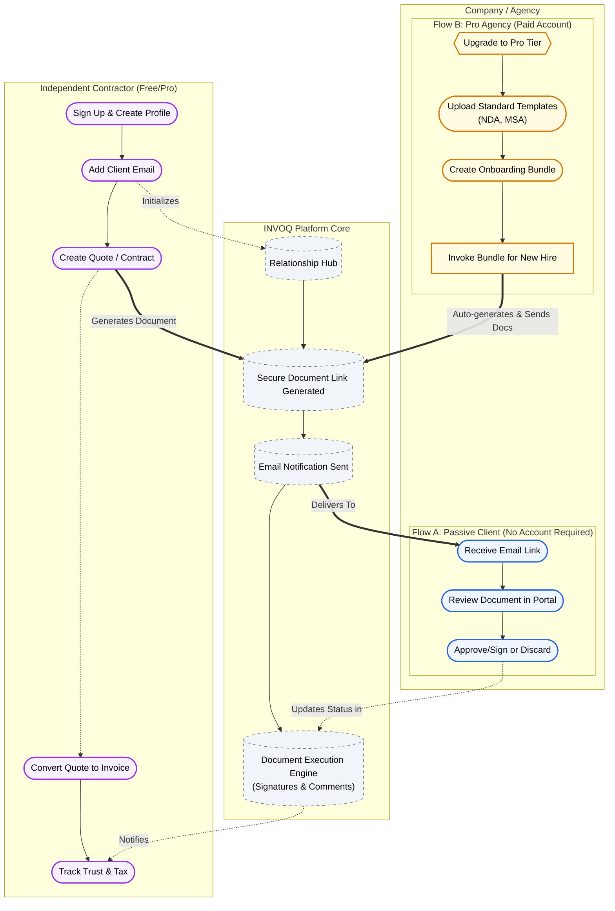

# INVOQ Flow Architecture

## Interaction Model

The following diagram illustrates the relationship-first interaction model between Contractors and Companies on the INVOQ platform. It highlights both the passive "invited" flow and the active "pro agency" onboarding flow.

### Key Legend
*   **Purple Node**: Contractor actions.
*   **Blue Node**: Passive Company actions (interacting with documents sent to them).
*   **Gold Node**: Premium operations. Flow B represents the specific premium use-case of a company upgrading to Pro to actively manage a fleet of contractors using Onboarding Bundles.
*   **Dashed Outline (Center)**: The INVOQ infrastructure securely managing the handoffs between parties.
